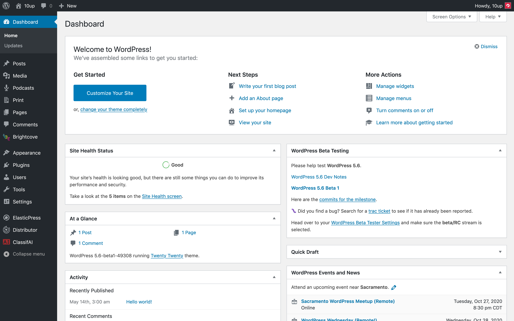

# 10up Plugin Scaffold

**DEPRECATED.** Use https://github.com/10up/wp-scaffold

> At 10up, we strive to provide digital products that yield a top-notch user experience. In order to improve both our efficiency and consistency, we need to standardize what we use and how we use it. This plugin scaffold allows us to share initial set up procedures to make sure all projects can get up and running as quickly as possible while closely adhering to 10up's high quality standards.

[](#support-level) [](https://github.com/10up/plugin-scaffold/blob/master/LICENSE.md)

## Dependencies

1. [Node >= 8.11 & NPM](https://www.npmjs.com/get-npm) - Build packages and 3rd party dependencies are managed through NPM, so you will need that installed globally.
2. [Webpack](https://webpack.js.org/) - Webpack is used to process the JavaScript, CSS, and other assets.
3. [Composer](https://getcomposer.org/) - Composer is used to manage PHP.

## Getting Started

### Quick Start
Install 10up's command line tool for scaffolding new projects. You can download it from the [Project Scaffold repository](https://github.com/10up/project-scaffold). Setting up a new plugin is as easy as running `create-10up plugin plugin-name-here` in the terminal!

Browsersync requires a local development URL. This is currently set in the `package.json`, as `proxyUrl`.

### Direct Install
- Clone the repository
- Rename folder plugin-scaffold -> your project's name
- If copying files manually to an existing plugin directory instead of cloning directly from the repository, make sure to include the following files which may be hidden:

```
.babelrc
.browserslistrc
.editorconfig
.eslintignore
.eslintrc
.gitignore
```

The NPM commands will fail without these files present.

- Do case-sensitive search/replace for the following:

	- TenUpScaffold
	- TENUP_SCAFFOLD
	- tenup-scaffold
	- tenup_scaffold

- `cd` into the plugin folder
- run `npm run start` to build the front-end assets

## Webpack config

Webpack config files can be found in `config` folder:

- `webpack.config.dev.js`
- `webpack.config.common.js`
- `webpack.config.prod.js`
- `webpack.settings.js`

In most cases `webpack.settings.js` is the main file which would change from project to project. For example adding or removing entry points for JS and CSS.

## NPM Commands

- `npm run test` (runs phpunit)
- `npm run start` (install dependencies)
- `npm run watch` (watch)
- `npm run build` (build all files)
- `npm run build-release` (build all files for release)
- `npm run dev` (build all files for development)
- `npm run lint-release` (install dependencies and run linting)
- `npm run lint-css` (lint CSS)
- `npm run lint-js` (lint JS)
- `npm run lint-php` (lint PHP)
- `npm run lint` (run all lints)
- `npm run format-js` (format JS using eslint)
- `npm run format` (alias for `npm run format-js`)
- `npm run test-a11y` (run accessibility tests)

## Composer Commands

`composer lint` (lint PHP files)

`composer lint-fix` (lint PHP files and automatically correct coding standard violations)

## Contributing

We don't know everything! We welcome pull requests and spirited, but respectful, debates. Please contribute via [pull requests on GitHub](https://github.com/10up/plugin-scaffold/compare).

1. Fork it!
2. Create your feature branch: `git checkout -b feature/my-new-feature`
3. Commit your changes: `git commit -am 'Added some great feature!'`
4. Push to the branch: `git push origin feature/my-new-feature`
5. Submit a pull request

## Learn more about the default packages used with this project

- [10up Eslint config](https://www.npmjs.com/package/@10up/eslint-config)
- [10up Stylelint config](https://www.npmjs.com/package/@10up/stylelint-config)
- [Babel core](https://www.npmjs.com/package/@babel/core)
- [Babel Eslint](https://www.npmjs.com/package/babel-eslint)
- [Babel loader](https://www.npmjs.com/package/babel-loader)
- [Babel preset env](https://www.npmjs.com/package/@babel/preset-env)
- [Babel register](https://www.npmjs.com/package/@babel/register)
- [Browsersync](https://browsersync.io/)
- [Browsersync Webpack plugin](https://www.npmjs.com/package/browser-sync-webpack-plugin)
- [Browserslist](https://www.npmjs.com/package/browserslist)
- [Can I Use DB](https://www.npmjs.com/package/caniuse-db)
- [Clean Webpack plugin](https://www.npmjs.com/package/clean-webpack-plugin)
- [Copy Webpack plugin](https://www.npmjs.com/package/copy-webpack-plugin)
- [CSS loader](https://www.npmjs.com/package/css-loader)
- [CSS nano](https://www.npmjs.com/package/cssnano)
- [Eslint](https://www.npmjs.com/package/eslint)
- [Eslint loader](https://www.npmjs.com/package/eslint-loader)
- [Husky@next](https://www.npmjs.com/package/husky)
- [Imagemin plugin for Webpack](https://github.com/Klathmon/imagemin-webpack-plugin)
- [Lint Staged](https://www.npmjs.com/package/lint-staged)
- [Mini CSS extract plugin](https://www.npmjs.com/package/mini-css-extract-plugin)
- [PostCSS Import](https://www.npmjs.com/package/postcss-import)
- [PostCSS loader](https://www.npmjs.com/package/postcss-loader)
- [PostCSS preset-env](https://www.npmjs.com/package/postcss-preset-env)
- [Stylelint](https://www.npmjs.com/package/stylelint)
- [Stylelint config WordPress](https://www.npmjs.com/package/stylelint-config-wordpress)
- [Stylelint declaration use variable](https://www.npmjs.com/package/stylelint-declaration-use-variable)
- [Stylelint order](https://www.npmjs.com/package/stylelint-order)
- [Stylelint Webpack plugin](https://www.npmjs.com/package/stylelint-webpack-plugin)
- [Terser](https://www.npmjs.com/package/terser)
- [Webpack](https://www.npmjs.com/package/webpack)
- [Webpack CLI](https://www.npmjs.com/package/webpack-cli)
- [Webpack fix style only entries](https://www.npmjs.com/package/webpack-fix-style-only-entries)
- [Webpack merge](https://www.npmjs.com/package/webpack-merge)
- [Webpackbar](https://www.npmjs.com/package/webpackbar)
- [PHPCS](https://github.com/squizlabs/PHP_CodeSniffer)

## Frequently Asked Questions

### A question that someone might have

An answer to that question.



## Support Level

**Active:** 10up is actively working on this, and we expect to continue work for the foreseeable future including keeping tested up to the most recent version of WordPress.  Bug reports, feature requests, questions, and pull requests are welcome.

## Like what you see?

<a href="http://10up.com/contact/"></a>
